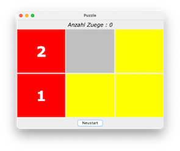

# Klausurvorbereitung

Wir beginnen mit allgemeinen Betrachtungen zum Grundgerüst. 

### Mögliches Grundgerüst

Wie Sie wissen, ist das Fenster (`JFrame`) im [BorderLayout](../gui/#borderlayout). Das bedeutet, dass das Fenster in fünf Bereiche (`Container`) unterteilt ist. Sie müssen sich bei der Konfiguration überlegen, welche der fünf Bereiche Sie benötigen. 

=== "Grundgerüst"
	```java linenums="1"
	import java.awt.BorderLayout;

	import javax.swing.JFrame;
	import javax.swing.JPanel;

	public class GrundgeruestOhneCanvas extends JFrame{
		JPanel content;
		
	    public GrundgeruestOhneCanvas()
	    {
	        super();
	        this.setTitle("GrundgeruestMitCanvas");
	        this.setDefaultCloseOperation(JFrame.EXIT_ON_CLOSE);    

	        this.content = this.initCenter();
	        this.getContentPane().add(this.content, BorderLayout.CENTER);
	        
	        // von den folgenden vier Zeilen werden eventuell eine oder mehrere oder alle auskommentiert
	        this.getContentPane().add(this.initNorth(), BorderLayout.NORTH);
	        this.getContentPane().add(this.initSouth(), BorderLayout.SOUTH);
	        this.getContentPane().add(this.initEast(), BorderLayout.EAST);
	        this.getContentPane().add(this.initWest(), BorderLayout.WEST);

	        this.setSize(400, 300);
	        this.setLocation(300,200);
	        this.setVisible(true);
	    }

	    private JPanel initCenter() 
	    {
	    	JPanel center = new JPanel();
	    	// hier das JPanel fuer CENTER befuellen
	    	return center;
	    }
	    
	    private JPanel initNorth() 
	    {
	    	JPanel north = new JPanel();
	    	// hier das JPanel fuer NORTH befuellen
	    	return north;
	    }
	      
	    private JPanel initSouth() 
	    {
	    	JPanel south = new JPanel();
	    	// hier das JPanel fuer SOUTH befuellen
	    	return south;
	    }
	    
	    
	    private JPanel initEast() 
	    {
	    	JPanel east = new JPanel();
	    	// hier das JPanel fuer EAST befuellen
	    	return east;
	    }
	      
	    private JPanel initWest() 
	    {
	    	JPanel west = new JPanel();
	    	// hier das JPanel fuer WEST befuellen
	    	return west;
	    }

	    public static void main(String[] args) 
	    {
	        new GrundgeruestOhneCanvas();
	    }
	}
	```


In diesem Grundgerüst werden alle fünf Bereiche des Fensters mit `JPanel` befüllt. Sollten Sie z.B. kein Panel im `EAST`- und im `WEST`-Bereich des Fensters benötigen, dann löschen Sie einfach die Zeilen `21` und `22` sowie die beiden Methoden `initEast()` und `initWest()`. 

Beachten Sie, dass `JPanel` ohne Angabe eines LayoutManagers im [FlowLayout](../gui/#flowlayout) sind. Das können Sie [ändern](../gui/#layout-manager) und die einzelnen `JPanel` auch noch [weiter verschachteln](../gui/#verschachteln-von-layout-managern).


### Schiebepuzzle

??? "Aufgabe Schiebepuzzle"

	1. Implementieren Sie folgendes Puzzle: 
		
		

		- obige Abbildung zeigt den Anfangszustand des Puzzles (`2` über `1` links)

		

		- obige Abbildung zeigt den Endzustand des Puzzles (`1` über `2` links)

		- Das Puzzle besteht aus 5 „Kacheln“, 3 gelben und 2 roten. Die roten Kacheln sind mit einer `1` und einer `2` nummeriert. Am Anfang steht die rote Kachel mit der `2` über der roten Kachel mit der `1`. (siehe erste Abb.) Ziel des Puzzles ist es, die beiden roten Kacheln zu vertauschen. Wenn links die `1` über der `2` steht, ist das Puzzle beendet. Wo die gelben Kacheln im Endzustand sind, ist egal (siehe zweite Abb.). Ein Feld ist stets frei (grau dargestellt). In dieses Feld kann eine benachbarte Kachel geschoben werden.

		- Zeigen Sie oben die Anzahl der Züge an. Wenn der Endzustand erreicht ist, kann nicht mehr gezogen werden! Der Button `Neustart` setzt alles wieder auf Anfang. 

		- Die Programmierung bleibt ganz Ihnen überlassen. Zum Schieben einer Kachel auf das leere Feld, klickt man auf die Kachel selbst. Diese „bewegt“ sich dann auf das leere (graue) Feld und hinterlässt ein leeres (graues) Feld (siehe folgende Abb.)

		

	2. **Tipps:** 	

		- Am einfachsten bekommt man ein Label in die Mitte eines Panels gesetzt, wenn das Panel im `GridLayout(1,1)` (oder sogar parameterlos) ist und Sie für das Label `label.setHorizontalAlignment(JLabel.CENTER);` definieren

		- die (Schrift-)Farbe eines Labels setzt man mit `label.setForeground(Color);`

		- die (Hintergrund-Farbe eines Panels setzt man mit `panel.setBackground(Color);`

		- für das Identifizieren des entsprechenden Panels, auf das man geklickt hat, könnte es hilfreich sein, sich dafür eine eigene Klasse zu schreiben (die von JPanel erbt). Muss aber nicht. Sie können auch die Quelle des `MouseEvent` identifizieren. 

		- wahrscheinlich ist es am einfachsten, ein zweidimensionales Array 2x3 als Datenstruktur für Ihr Puzzle zu verwenden


??? question "Lösung Schiebepuzzle"

	```java linenums="1"
	import java.awt.BorderLayout;
	import java.awt.Color;
	import java.awt.Font;
	import java.awt.GridLayout;
	import java.awt.event.ActionEvent;
	import java.awt.event.ActionListener;
	import java.awt.event.MouseEvent;
	import java.awt.event.MouseListener;

	import javax.swing.*;

	public class Puzzle extends JFrame
	{
		JLabel infoLabel;
		int anzMoves;
		enum State {EINS, ZWEI, LEER, GELB}
		State[][] field;
		MyPanel[][] panels;
		JPanel mainPanel;

		Puzzle()
		{
			super("Puzzle");
			this.setDefaultCloseOperation(JFrame.EXIT_ON_CLOSE);
			this.getContentPane().add(this.infoLabelPanel(), BorderLayout.NORTH);
			this.getContentPane().add(this.mainPanelStart(), BorderLayout.CENTER);
			this.getContentPane().add(this.buttonPanel(), BorderLayout.SOUTH);
			this.setSize(500, 400);
			this.setVisible(true);
		}

		/****************************************
		 * erstmal alles fuer das Model
		 * initiale Belegung von field
		 */
		void initialisiereField()
		{
			this.field = new State[2][3];
			this.field[0][0] = State.ZWEI;
			this.field[0][1] = State.LEER;
			this.field[0][2] = State.GELB;
			this.field[1][0] = State.EINS;
			this.field[1][1] = State.GELB;
			this.field[1][2] = State.GELB;	
		}

		/**
		 * Hilfsmethode, um zu wissen, in welcher Zeile sich das leere Feld befindet
		 * damit ist makeMove() etwas kuerzer
		 * @return zeile von LEER
		 */
		int getLeerZeile()
		{
			for(int zeile=0; zeile<2; zeile++)
				for(int spalte=0; spalte<3; spalte++)
					if(this.field[zeile][spalte]==State.LEER) return zeile;

			return -1; // fehlerfall - kommt aber nicht vor
		}

		/**
		 * Hilfsmethode, um zu wissen, in welcher Zeile sich das leere Feld befindet
		 * damit ist makeMove() etwas kuerzer
		 * @return spalte von LEER
		 */
		int getLeerSpalte()
		{
			for(int zeile=0; zeile<2; zeile++)
				for(int spalte=0; spalte<3; spalte++)
					if(this.field[zeile][spalte]==State.LEER) return spalte;

			return -1; // fehlerfall - kommt aber nicht vor
		}

		/**
		 * von field[fromZeile][fromSpalte] aus wird gezogen
		 * es wird geprueft, ob die leere Kachel entweder in der gleichen zeile 
		 * ist --> dann muss die spalte von LEER entweder links oder rechts sein (+/+ 1)
		 * oder in der gleichen spalte --> dann muss die zeile von LEER entweder
		 * darueber oder darunter sein (+/+ 1)
		 * @param fromZeile
		 * @param fromSpalte
		 * @return ob zug ausgefuehrt wurde oder nicht
		 */
		boolean makeMove(int fromZeile, int fromSpalte)
		{
			if(this.field[fromZeile][fromSpalte]!=State.LEER)
			{
				int zeileLeer = this.getLeerZeile();
				int spalteLeer = this.getLeerSpalte();
				if((Math.abs(zeileLeer-fromZeile)==1 && spalteLeer-fromSpalte==0) || (zeileLeer-fromZeile==0 &&  Math.abs(spalteLeer-fromSpalte)==1))
				{
					this.field[zeileLeer][spalteLeer]=this.field[fromZeile][fromSpalte];
					this.field[fromZeile][fromSpalte]=State.LEER;
					this.printField();	// nur zum debuggen
					this.anzMoves++;
					return true;
				}
			}
			return false;
		}

		/**
		 * definition des endzustands (links oben EINS, links unten ZWEI)
		 * @return ob endzustand erreicht oder nicht
		 */
		boolean ende()
		{
			return (this.field[0][0]==State.EINS && this.field[1][0]==State.ZWEI);
		}

		/*********************************************
		 * jetzt alles fuer die View - ganz zu Anfang
		 */

		JPanel initialiserePanels()
		{
			this.panels = new MyPanel[2][3];
			for(int zeile=0; zeile<2; zeile++)
			{
				for(int spalte=0; spalte<3; spalte++)
				{
					this.panels[zeile][spalte] = new MyPanel(zeile, spalte);
					this.panels[zeile][spalte].view(this.field[zeile][spalte]);
					this.mainPanel.add(this.panels[zeile][spalte]);
				}
			}
			return this.mainPanel;
		}

		JPanel mainPanelStart()
		{
			this.mainPanel = new JPanel();
			this.mainPanel.setLayout(new GridLayout(2,3,3,3));
			this.initialisiereField();		// model
			this.initialiserePanels();		// view
			return mainPanel;
		}

		JPanel infoLabelPanel()
		{
			JPanel infoPanel = new JPanel();
			this.infoLabel = new JLabel("Anzahl Zuege : " + this.anzMoves);
			this.infoLabel.setFont(new Font("Verdana", Font.ITALIC, 18));
			infoPanel.add(this.infoLabel);
			return infoPanel;
		}

		JPanel buttonPanel()
		{
			JPanel buttonPanel = new JPanel();
			JButton neuStart = new JButton("Neustart");
			neuStart.addActionListener(new ActionListener() {

				@Override
				public void actionPerformed(ActionEvent e)
				{
					Puzzle.this.restart();			
				}

			});
			buttonPanel.add(neuStart);
			return buttonPanel;
		}

		/**
		 * jetzt für Restart und Update
		 * Restart: nach Druecken des Buttons "Neustart"
		 * Update: nach jedem Zug
		 */
		void restart()
		{
			this.anzMoves=0;
			this.infoLabel.setFont(new Font("Verdana", Font.ITALIC, 18));
			this.initialisiereField();
			this.updatePanels();
		}

		void updateLabel(boolean ende)
		{
			if(ende)
			{
				this.infoLabel.setFont(new Font("Verdana", Font.ITALIC|Font.BOLD, 18));	
				this.infoLabel.setText("Ende! Anzahl Zuege : " + this.anzMoves);
			}
			else
			{
				this.infoLabel.setText("Anzahl Zuege : " + this.anzMoves);
			}
		}

		void updatePanels()
		{
			for(int zeile=0; zeile<2; zeile++)
			{
				for(int spalte=0; spalte<3; spalte++)
				{
					this.panels[zeile][spalte].view(this.field[zeile][spalte]);
				}
			}
			this.updateLabel(this.ende());
		}

		/**
		 * das ist nur zum "Debuggen" - aber ganz nuetzlich
		 */
		void printField()
		{
			for(int zeile=0; zeile<2; zeile++)
			{
				for(int spalte=0; spalte<3; spalte++)
				{
					if (this.field[zeile][spalte]==State.LEER) System.out.print(" -");
					else if (this.field[zeile][spalte]==State.EINS) System.out.print(" 1");
					else if (this.field[zeile][spalte]==State.ZWEI) System.out.print(" 2");
					else if (this.field[zeile][spalte]==State.GELB) System.out.print(" o");
				}
				System.out.println();
			}
			System.out.println();
		}

		/**
		 * die Klasse für die "Kacheln"
		 * die "Kacheln" sind JPanels (mit allen JPanel-Methoden)
		 * ausserdem noch nuetzliche Objekteigenschaften: zeile, spalte und das Label, 
		 * das auf der Kachel ist (für GELB und LEER ist das Label leer)
		 */
		class MyPanel extends JPanel implements MouseListener
		{
			int zeile;
			int spalte;
			JLabel label;

			MyPanel(int zeile, int spalte)
			{
				super();
				this.zeile = zeile;
				this.spalte = spalte;
				this.setLayout(new GridLayout());
				this.label = new JLabel();
				this.label.setHorizontalAlignment(JLabel.CENTER);
				this.label.setForeground(Color.WHITE);
				this.label.setFont(new Font("Verdana", Font.BOLD, 48));
				this.add(label);
				this.addMouseListener(this);
			}

			void view(State state)
			{
				switch(state)	// geht natuerlich auch mit if(state==State.EINS) usw.
				{
					case EINS : this.setBackground(Color.RED);
								this.label.setText("1");		break;
					case ZWEI : this.setBackground(Color.RED);
								this.label.setText("2");		break;
					case LEER : this.setBackground(Color.LIGHT_GRAY);
								this.label.setText("");			break;
					case GELB : this.setBackground(Color.YELLOW);
								this.label.setText("");			break;
				}
			}

			@Override
			public void mouseClicked(MouseEvent e)
			{
				if(!Puzzle.this.ende() && Puzzle.this.makeMove(this.zeile, this.spalte)) Puzzle.this.updatePanels();		
			}

			@Override public void mousePressed(MouseEvent e) {}
			@Override public void mouseReleased(MouseEvent e) {}
			@Override public void mouseEntered(MouseEvent e) {}
			@Override public void mouseExited(MouseEvent e) {}

		}

		public static void main(String[] args)
		{
			new Puzzle();

		}

	}	
	```

Zur Klausurvorbereitung eignet sich auch die Übung [Klicks zählen](../uebungen/#klausurvorbereitung-klicks-zahlen).


