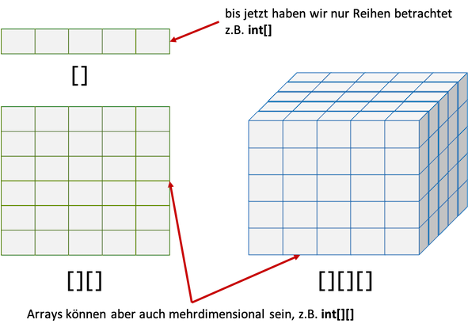

# Mehrdimensionale Arrays

Arrays sind Objekte. Der Typ eines Arrays ergibt sich aus

> TypDerElemente[]

Wir geben also den Typ der Elemente an (alle Elemente in einem Array sind vom selben Typ) und schreiben eckige Klammern `[]` dahinter. Dabei kann der Typ der Elemente sowohl ein Wertetyp sein als auch ein Referenztyp. Es könnte also sein, dass der Typ der Elemente selbst wieder ein Array ist. Wir würden dann für `TypDerElemente[]` für den Typ selbst wieder ein `TypDerElemente[]` einsetzen und bekämen `TypDerElemente[][]`. Und genau das geht auch - wir sprechen von *mehrdimensionalen* Arrays: 



Wir werden zweidimensionale Arrays betrachten. Vorstellen können wir uns gerade noch dreidimensionale, aber höhere Dimensionen sollten wir gar nicht verwenden, da dies eigentlich nur mit Fehlern behaftet sein kann. In zweidiemensionalen Arrays haben wir nun anstelle eines Indexes zwei. Man kann sich diese Indizes so verstellen, als würde der eine Index die Spalten nummerieren und der andere die Zeilen. Welcher Index wofür steht, bleibt Ihnen überlassen. Wir betrachten ein einführendes Beispiel:

=== "zweidimensionales Array für das kleine Einmaleins"
	```java linenums="1"
	public static void main(String[] args) 
	{
		int anzZeilen=10;
		int anzSpalten=10;

		int[][] einmaleins = new int[anzZeilen][anzSpalten]; 

		for(int i=0;i<einmaleins.length;i++)
		{
			for(int j=0;j<einmaleins[i].length;j++)
			{
				einmaleins[i][j]=(i+1)*(j+1);
			}
		}
	}
	```

In Zeile `6` wird das zweidiensionale `int`-Array deklariert (`int[][] einmaleins`) und auch gleichzeitig erzeugt (`new int[anzZeilen][anzSpalten]`). Das passiert genau so, wie wir es bereits von den eindimensionalen Arrays kennen, nur dass wir nun zwei Klammerpaare (`[][]`) und zwei Indizes haben. 

Da wir zwei Indizes haben, haben wir auch eine verschachtelte `for`-Schleife, um alle Elemente des Arrays betrachten zu können. Die Wertzuweisung erfolgt in Zeile `12`. Beachten Sie, dass die Abbruchbedingung der äußeren `for`-Schleife die Anzahl der Zeilen ermittelt (`einmaleins.length`) und in der inneren `for`-Schleife die Anzahl der Spalten in jeder Zeile (`einmaleins[i].length`) abgefragt wird. 

Den Zugriff auf ein solches zweidimensionales Array kann man sich so vorstellen:


Der erste Index gibt danach die jeweilige Zeile an und der zweite die Spalte. Das bleibt aber Ihrer Interpretation überlassen - könnte auch genau andersherum sein. Manche stellen sich ja ein eindimensionales Array auch vertikal vor und andere horizontal. Wichtig ist nur, dass Sie sich für eine Interpretation entscheiden und diese dann auch konsistent umsetzen. 

Zur Festigung fügen wir in den obigen Code noch eine Ausgabe des zweidimensionalen Arrays ein: 


=== "Einmaleins mit Ausgabe"
	```java linenums="1" hl_lines="18-25"
	public static void main(String[] args) 
	{
		int anzZeilen=10;
		int anzSpalten=10;

		int[][] einmaleins = new int[anzZeilen][anzSpalten]; 

		// Wertezuweisungen
		for(int i=0;i<einmaleins.length;i++)
		{
			for(int j=0;j<einmaleins[i].length;j++)
			{
				einmaleins[i][j]=(i+1)*(j+1);
			}
		}

		// Ausgabe auf Konsole
		for(int i=0;i<einmaleins.length;i++)
		{
			for(int j=0;j<einmaleins[i].length;j++)
			{
				System.out.printf("%4d", einmaleins[i][j]);
			}
			System.out.println();
		}
	}
	```

ergibt folgnde Ausgabe:

```bash
 	1   2   3   4   5   6   7   8   9  10
   	2   4   6   8  10  12  14  16  18  20
   	3   6   9  12  15  18  21  24  27  30
   	4   8  12  16  20  24  28  32  36  40
   	5  10  15  20  25  30  35  40  45  50
   	6  12  18  24  30  36  42  48  54  60
   	7  14  21  28  35  42  49  56  63  70
   	8  16  24  32  40  48  56  64  72  80
   	9  18  27  36  45  54  63  72  81  90
   10  20  30  40  50  60  70  80  90 100
```

Wir werden zweidimensionale Arrays in [Aufgabe 3](../aufgaben/#aufgabe-3-solitaire) noch weiter üben. 